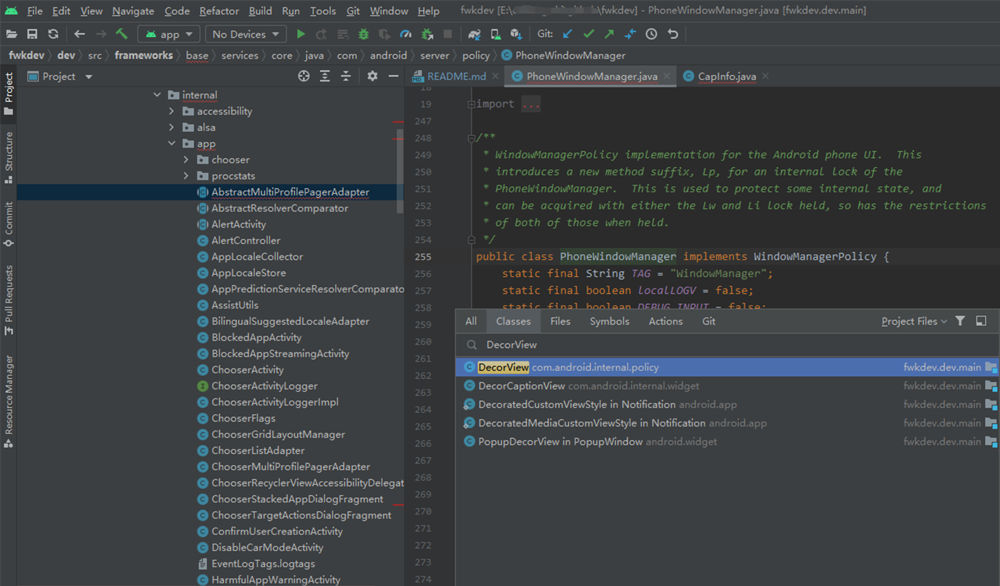

# FwkDev

This project offers a lightweight code structure solution for researching and developing Android Framework code.

By configuring build.gradle to index some core framework code, you can easily import it locally for studying and analyzing framework code. This facilitates code hints and navigation support in Android Studio.

> The problems solved by this project are:
> 1. Application Development: To make a new chip project compatible, only the lightweight structural part of the Framework needs to be extracted.
> 2. System Feature Development: Compatible across different platforms by configuring the required core source code.
> 3. System Source Code Reading, Differential Comparison, Competitor Analysis, etc., focusing only on core code without needing to import the entire Android suite.

## Project Structure
This project is divided into 3 parts:
- Branches indexing Android native code: `android-14.0.0_r17`, `android-13.0.0_r52`, etc.
- The main branch `main` is the structure indexing Android Framework code.
- The `dev` branch is a lightweight and efficient way of Android Framework development that requires certain configurations to extract files from a remote server and perform pull/push to devices.

## Reading Specific Code
- Pull a specific branch, e.g., pull Android 13 source code:
```bash
git clone https://github.com/10cl/fwkdev.git -b android-13.0.0_r52
```
Open the project in Android Studio to read and analyze Framework source code effortlessly.


## Framework Development Environment
Configure to pull the local project, enabling debugging breakpoints on local devices. Simplify the Android Framework development process through scripts: writing local code -> synchronizing to the build environment -> compiling -> extracting generated files from `out` -> pushing to devices -> rebooting for updates.

### Index Your Own Project
1. Initialize your project name.
Create a `project` and store your system projects inside following your internal or custom-defined standards, like `{chip_platform_model_Android_version_XXX}`:
```
->project $ ls
QCOM_SM8650_14.0_xxx_xxx/
QCOM_qm215_10.0_xxx_xxx/
QCOM_sdm660_10.0_xxx_xxx/
SPRD_t610_13.0_xxx_xxx/
SPRD_9863_10.0_xxx_xxx/
SPRD_9863_11.0_xxx_xxx/
SPRD_9863_9.x_5.0_xxx_xxx/
SPRD_ums9620_11.0_xxx_xxx/
mtk_6765_10.0_xxx_xxx/
mtk_6769_11.0_xxx_xxx/
mtk_6771_11.0_xxx_xxx/
mtk_6833_11.0_xxx_xxx/
mtk_6877_11.0_xxx_xxx/
```
Clone the repository:
```bash
git clone https://github.com/10cl/fwkdev.git -b dev QCOM_SM8650_14.0_xxx_xxx
```

### Configuration Items
The project connects to a remote server via the `ssh` module to fetch framework files and the generated files under `out` for `push`. In a Windows environment, if `Git` is configured, it includes this module by default.

#### Setting Up Passwordless Login Locally
`ssh-copy-id` is a convenient command-line tool used to copy SSH public keys from the local machine to the `authorized_keys` file on a remote machine, enabling passwordless login. When using SSH to log in remotely, you typically need to enter a password for authentication. However, by configuring SSH public key authentication, you can achieve a more secure and convenient authentication method.

The steps to use `ssh-copy-id` typically include:

1. Generate SSH key pair: Use the `ssh-keygen` command to generate an SSH key pair on the local machine, including public and private keys.

    ```bash
    ssh-keygen -t rsa
    ```

   This command will generate `id_rsa` (private key) and `id_rsa.pub` (public key) files in the `~/.ssh/` directory.

2. Copy the public key to the remote host using `ssh-copy-id`: Run the following command to add the local machine's public key to the `authorized_keys` file on the remote machine.

    ```bash
    ssh-copy-id -i ~/.ssh/id_rsa.pub {username}@{serverIP} -p{port}
    ```

   This will prompt for the user password of the remote machine, then copy the local machine's public key to the `~/.ssh/authorized_keys` file on the remote machine. Afterward, passwordless SSH login can be used.

#### local.properties
- Basic Configuration  
After basic configuration, you can pull remote system core code by executing the `pullFwk` task.
```properties
# Preserve original project configuration
# ...

### FwkDev Config: Server Config ###
server.path={project_root_directory}
server.ip={username}@{serverIP}
server.port={port}
```

- Commit Changes  
By adding `server.diff`, you can configure keywords to filter the changed files for upload. Then, execute `pushFwk` to upload the filtered changed files.
```properties
# Filters files for changes based on full paths containing the following keywords
server.diff=framework;
```

- Device Update  
By configuring `local.pushfwk=true` and `server.project={project_identifier}`, execute `pushUpdateJar` to download generated files from `/system/framework/` on the remote server to the local environment. Then use adb push to update the device and reboot.
```properties
### FwkDev Config: Push Jar file Config ###
local.pushfwk=true
# Android project compiled files are usually in out/target/product/{project_identifier}/system/framework/
server.project={project_identifier}
```

- Multi-Project Comparison  
After adding Beyond Compare to the environment variables, execute the `compareFile` task to run local `BComp`, comparing the current project `server.path` with the comparison project `server.compare_folder` based on the relative path configured in `server.compare`.
```properties
### FwkDev Config: Compare fold configuration ###
# Configure the root directory of the projects to compare
server.compare_folder=/home/10cl/project/QCOM_SM8650_14.0_xxx_xxx/
# Configure the relative path to compare
server.compare=frameworks/base/services/core/java/com/android/server/wm/
```

- Download Individual Files  
Execute the `pullServerFile` task to pull specific files from the server by configuring the `SERVER_FILE_LIST` variable.
